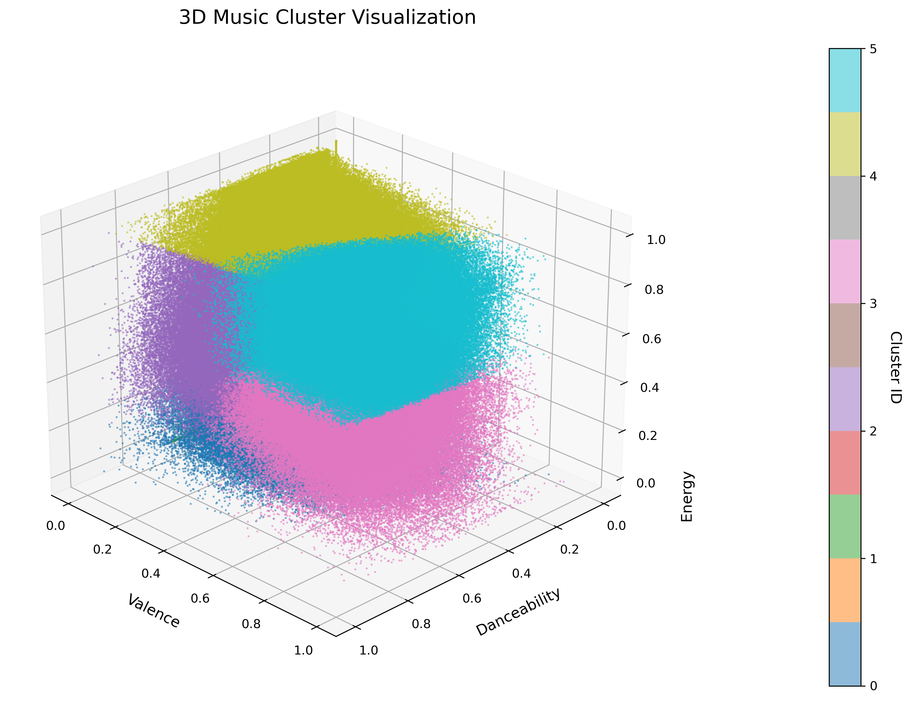

## 1. Instructions for how to build and execute on CHPC
- Module load CUDA for the gpu implementation
- Module load MPI for the distributed implementations
- Start by running the Makefile which will create executables for all implementations.
- Usage
    * Serial: ./serial <input_file> <number_of_clusters>
    * Shared: ./shared <input_file> <number_of_clusters> <thread_count>
    * Shared-GPU: ./shared-gpu <input_file> <number_of_clusters> <threads_per_block>
    * Distributed CPU: ./distributed <input_file> <number_of_clusters> <thread_count> 
    * Distributed-GPU: ./distributed-gpu <input_file> <number_of_clusters> <threads_per_block> <thread_count>

## 2. Description of the approach used for each of the following implementations
1. Serial
    - This is the standard, single-threaded version of the k-means clustering that processes sequentially. This is the baseline C++ implementation using vectors to assign poitns to the clusters and update the centroids over the fixed 100 epochs.
2. Parallel Shared Memory CPU
    - This version parallelizes the k-means clustering algorithm using OpenMP to distribute the work across CPU cores. It has two parallel regions: Cluster aassignment via a nearest-neighbor search and the statistical reduction for centroid updates. It maintains thread safety using OpenMP's reduction operations while keeping the same base algorithm from the serial implementation. 
3. Shared Memory CUDA GPU
    - This version parallelises the algorithm by using CUDA to offload the computation of assigning points to clusters to the GPU. Accumulating points for the computation of new centroids is a scenario to use reduction. But for the purpose of only using GPU it was only implemented in the Distributed Memory GPU option where we combined all techniques.
4. Distributed Memory CPU
    - This verision uses MPI and OpenMP to implement a distributed-memory parallelism across the nodes with shared-memory within the nodes. Rank 0 handles I/O and broadcasts the initial centroids while work gets distributed with MPI_Scatter.
5. Distributed Memory GPU
    - This method uses MPI for distributed-memory across nodes, OpenMP for shared-memory threading within the nodes, and GPU acceleration for the computationally intensive operations. Rank 0 process readds and distributes data evenly via MPI_Scatter, while all the processes use MPI_Allreduce to synchronize cluster statistics. The GPU kernels handle the parallel distance calculations during the cluster assignment, OpenMP accelerates the local reductions.

## 3. Scaling study experiments where you compare implementations
- 1 vs 2 

| Threads | Runtime in Seconds | Speedup |
|----------|----------|----------|
| 1 (Serial) | 31.1041 | 1.0x |
| 2 | 7.45823 | 4.17x |
| 4 | 3.88382 | 8.01x |
| 8 | 4.17708 | 7.45x |
| 16 | 5.08855 | 6.11x |
| 32 | 9.34725 | 3.33x |
| 64 | 5.71546 | 5.44x |
| 128 | 5.82273 | 5.34x |
| 256 | 5.85255 | 5.31x |
| 512 | 6.36135 | 4.89x |
| 1024 | 6.55951 | 4.74x |

- 3 

| Threads per Block | Timing in Seconds | Cuda elapsed time in Milliseconds |
|----------|----------|----------|
| 4 | 51.6468 | 348.291 |
| 8 | 51.4146 | 188.485 |
| 16 | 51.2882 | 102.235 |
| 32 | 51.2957 | 63.1103 |
| 64 | 51.1998 | 66.5643 |
| 128 | 51.3613 | 62.6774 |
| 256 | 51.1931 | 62.1332 |
| 512 | 51.517 | 73.3961 |
| 1024 | 51.3535 | 63.9531 |

- 4 vs 5 (note: these will have to use from 2 to 4 nodes of any of the CHPC clusters)

| Number of Clusters (1064 threads) | Timing in Seconds CPU | Timing in Seconds GPU |
|----------|----------|----------|
| 2 | 36.7596 | 37.7818   |
| 4 | 43.2032 | 41.4922 |
| 8 | 113.039   | 103.287 |
| 16 | 391.539 | 354.859  |

| Threads (per block for gpu, total in cpu)| Timing in Seconds CPU| Timing in Milliseconds GPU|
|----------|----------|----------|
| 4 | 35.5861 | 38.2805 |
| 8 | 36.0909 | 37.9196 |
| 16 | 36.4038 | 38.2282 |
| 32 | 46.2721 | 38.1518 |
| 64 | 83.7466 | 38.2738 |
| 128 | 36.6428  | 38.6429 |
| 256 | 36.2209 | 37.7776 |
| 512 | 36.4113 | 38.2375 |
| 1024 | 36.6035 | 37.8799 |

## 4. Use a  validation function to check that the result from parallel implementations is equal to the serial output implementation
- Serial vs. Shared: The files are identical
- Serial vs. GPU: The files are identical
- Serial vs. Distributed: The files are identical
- Serial vs. Distributed-GPU:The files are identical

The validation is 100% correct for every implementation with a caveat that the number of points was divisible by the number of processors for the distributed implementations

## 5. reuse code across implementations
utils.cpp, utils.hpp, and cuda.cu

## 6. Visualization of the output
This is done using the plotter.py script and outputs to a file named 3d_clusters.png.

## 7. Clearly explain who was responsible for which task on the project 
Kade: Serial and Parallel shared memory implementations, as well as the python scripts for visualization and validation. 

Rett: GPU implementations, as well as the util files and Makefile.

Rebecca: Distributed implementation.

## References
[Serial Implementation Tutorial](https://reasonabledeviations.com/2019/10/02/k-means-in-cpp/)
